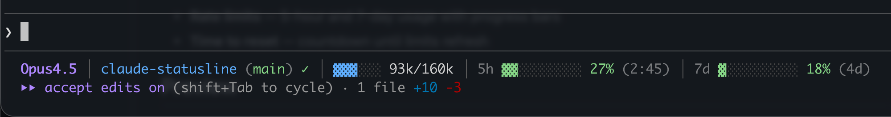

# Claude Code Statusline

Compact, colorful status line for [Claude Code](https://claude.ai/code) CLI showing **5-hour & 7-day rate limits**, context usage, model and git info in real time.



## Why?

Claude Code doesn't show your 5-hour and weekly rate limits in the UI. This statusline fetches them directly from Anthropic API so you always know how much capacity you have left.

## Features

- **Context usage** — real-time token consumption with color-coded alerts (blue < 70%, yellow 70-89%, orange ≥ 90%)
- **Rate limits** — 5-hour and 7-day usage with colored progress bars + time until reset
- **Model name** — short colored name (Opus4.5, Sonnet4, Haiku)
- **Directory & Git** — current folder, branch, uncommitted changes count

## Preview

```
Opus4.5 │ my-project (main) ✓ │ Ctx ▓▓░░░░░░ 28% 49k/200k │ 5h ▓░░░░░░░ 2% (4:11) │ 7d ▓▓░░░░░░ 24% (3d)
```

- `Ctx ▓▓░░░░░░ 28% 49k/200k` — context bar with percentage and token count
- `5h 2% (4:11)` — 2% of 5-hour limit used, resets in 4 hours 11 minutes
- `7d 24% (3d)` — 24% of weekly limit used, resets in 3 days

## Installation

1. Copy scripts to Claude config directory:

```bash
mkdir -p ~/.claude/scripts
curl -o ~/.claude/scripts/context-bar.sh https://raw.githubusercontent.com/bartleby/claude-statusline/main/context-bar.sh
curl -o ~/.claude/scripts/update-usage-cache.sh https://raw.githubusercontent.com/bartleby/claude-statusline/main/update-usage-cache.sh
chmod +x ~/.claude/scripts/*.sh
```

2. Add to `~/.claude/settings.json`:

```json
{
  "statusLine": {
    "type": "command",
    "command": "~/.claude/scripts/context-bar.sh"
  }
}
```

3. Restart Claude Code.

## Requirements

- macOS (uses `security` for Keychain access)
- `jq` — JSON processor (`brew install jq`)
- `git` — for repository info

> **Windows users**: See [windows/](windows/) folder for Python version that works on Windows.

## How it works

### Rate limits
Fetches usage data from Anthropic API (`/api/oauth/usage`) using OAuth token from macOS Keychain. Data is cached and refreshed in background every 60 seconds — no lag in your statusline.

### Context bar
Uses `remaining_percentage` directly from Claude Code API to show accurate context usage with color-coded warnings:
- **Blue** (< 70%) — plenty of context left
- **Yellow** (70-89%) — approaching limit, be mindful of token usage
- **Orange** (≥ 90%) — critical, context will auto-compact soon

## License

MIT
