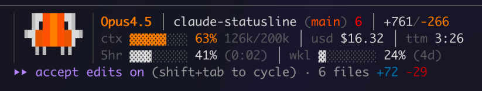

# Claude Code Statusline

Compact, colorful status line for [Claude Code](https://claude.ai/code) CLI with **18 themes**, real-time **rate limits**, context usage, cost tracking and git info.



## Features

- **18 Themes** — from Kratos to Spiderman, switch with `/skin` command
- **Rate limits** — 5-hour and 7-day usage with progress bars + time until reset
- **Context usage** — real-time token consumption with color-coded alerts
- **Cost & Time** — session cost in USD and total time
- **Git info** — branch name, uncommitted changes count
- **Lines changed** — added/removed lines counter

## Quick Install (macOS)

```bash
git clone https://github.com/anthropics/claude-statusline.git
cd claude-statusline
./install.sh
```

Restart Claude Code and you're done!

## Manual Installation (macOS)

### 1. Copy scripts

```bash
mkdir -p ~/.claude/scripts
cp context-bar.sh ~/.claude/scripts/
cp themes.sh ~/.claude/scripts/
cp claude-skin.sh ~/.claude/scripts/
cp update-usage-cache.sh ~/.claude/scripts/
chmod +x ~/.claude/scripts/*.sh
```

### 2. Configure statusline

Add to `~/.claude/settings.json`:

```json
{
  "statusLine": {
    "type": "command",
    "command": "~/.claude/scripts/context-bar.sh"
  }
}
```

### 3. (Optional) Enable /skin command

Create hook file `~/.claude/hooks/skin-hook.sh`:

```bash
#!/bin/bash
INPUT=$(cat)
PROMPT=$(echo "$INPUT" | jq -r '.prompt // empty')

if [[ "$PROMPT" =~ ^/skin ]]; then
    ARG=$(echo "$PROMPT" | sed 's|^/skin[[:space:]]*||')
    ~/.claude/scripts/claude-skin.sh $ARG >&2
    exit 2
fi
exit 0
```

Make it executable:

```bash
chmod +x ~/.claude/hooks/skin-hook.sh
```

Add hook to `~/.claude/settings.json`:

```json
{
  "statusLine": {
    "type": "command",
    "command": "~/.claude/scripts/context-bar.sh"
  },
  "hooks": {
    "UserPromptSubmit": [
      {
        "matcher": "",
        "hooks": [
          {
            "type": "command",
            "command": "~/.claude/hooks/skin-hook.sh"
          }
        ]
      }
    ]
  }
}
```

### 4. Restart Claude Code

## Themes

18 themes available. Use `/skin` to see gallery or `/skin <name>` to apply.

| Theme | Description |
|-------|-------------|
| **kratos** | God of War — red accent on cream (default) |
| **spiderman** | Red mask, blue body |
| **captain** | Captain America shield — star and stripes |
| **shadow** | Monochrome grey |
| **ocean** | Deep blue gradient |
| **goose** | Grey-white with orange center |
| **matrix** | Green terminal |
| **sakura** | Soft pink cherry blossom |
| **aurora** | Teal northern lights |
| **ember** | Glowing orange coals |
| **frost** | Ice blue crystal |
| **odi** | White cat with pink nose |
| **cyberpunk** | Pink and cyan neon |
| **lavender** | Soft purple |
| **gold** | Rich golden |
| **inferno** | Intense red-orange fire |
| **amethyst** | Deep purple crystal |
| **bubblegum** | Bright pink |

Press `Shift+Tab` to refresh statusline after changing skin.

## Requirements

- **macOS** (uses `security` for Keychain access)
- `jq` — JSON processor (`brew install jq`)
- `git` — for repository info

## Windows

> **Note**: Theme system and `/skin` command are not yet available on Windows. See [windows/](windows/) folder for basic Python version.

## How it works

### Rate limits
Fetches usage data from Anthropic API using OAuth token from macOS Keychain. Data is cached and refreshed in background every 60 seconds.

### Context bar
Uses `used_percentage` from Claude Code API with color-coded warnings:
- **Normal** (< 70%) — plenty of context
- **Warning** (70-89%) — approaching limit
- **Critical** (≥ 90%) — will auto-compact soon

### Themes
All themes defined in `themes.sh`. Each theme sets UI colors and logo appearance. Current theme stored in `~/.claude/current_skin`.

## License

MIT
