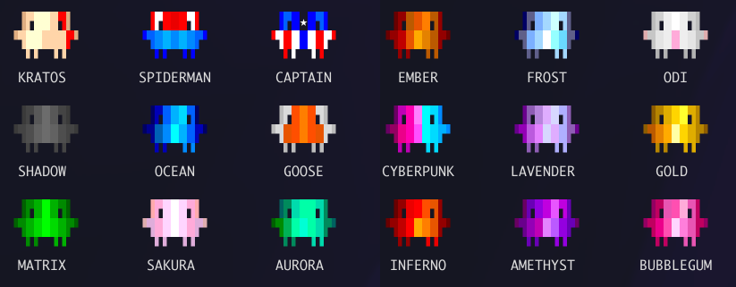

# Claude Code Statusline

Compact, colorful status line for [Claude Code](https://claude.ai/code) CLI with **21 themes**, real-time **rate limits**, context usage, cost tracking and git info.

**Works on macOS, Linux, and Windows!**


## Features

- **21 Themes** — from Kratos to Spiderman, switch with `/skin` command
- **Rate limits** — 5-hour and 7-day usage with progress bars + time until reset
- **Context usage** — real-time token consumption with color-coded alerts
- **Cost & Time** — session cost in USD and total time
- **Git info** — branch name, uncommitted changes count
- **Lines changed** — added/removed lines counter

## Install

### macOS / Linux

```bash
curl -fsSL https://raw.githubusercontent.com/bartleby/claude-statusline/main/install.sh | bash
```

### Windows (PowerShell)

```powershell
irm https://raw.githubusercontent.com/bartleby/claude-statusline/main/windows/install.ps1 | iex
```

Press `Shift+Tab` to see the statusline!

## Themes

21 themes available. Use `/skin` to see gallery or `/skin <name>` to apply.

| Theme | Description |
|-------|-------------|
| **kratos** | God of War — red accent on cream (default) |
| **spiderman** | Red mask, blue body |
| **captain** | Captain America shield — star and stripes |
| **shadow** | Monochrome grey |
| **ocean** | Deep blue gradient |
| **goose** | Grey-white with orange center |
| **matrix** | Green terminal |
| **sakura** | Soft pink cherry blossom |
| **aurora** | Teal northern lights |
| **ember** | Glowing orange coals |
| **frost** | Ice blue crystal |
| **odi** | White cat with pink nose |
| **cyberpunk** | Pink and cyan neon |
| **lavender** | Soft purple |
| **gold** | Rich golden |
| **inferno** | Intense red-orange fire |
| **amethyst** | Deep purple crystal |
| **bubblegum** | Bright pink |
| **venom** | Black symbiote with white eyes |
| **vaporwave** | Retro pink/cyan aesthetic |
| **copper** | Bronze metallic |

Press `Shift+Tab` to refresh statusline after changing skin.

## Usage

### Reading the statusline

The statusline displays three rows of information:

```
▏ ▐▛███▜▌ ▕ Opus4.5 │ my-project (main) ✓ │ +12/-3
▏▝▜█████▛▘▕ ctx ▓▓░░░░░░ 28% 49k/200k │ usd $0.42 │ ttm 1:23
▏  ▘▘ ▝▝  ▕ 5hr ▓░░░░░░░ 12% (4:11) │ wkl ▓▓░░░░░░ 24% (3d)
```

**Row 1** — Model, directory, git branch, changes count, lines added/removed
**Row 2** — Context usage, session cost in USD, session time
**Row 3** — 5-hour rate limit with reset time, weekly rate limit with reset time

### Status indicators

| Indicator | Meaning |
|-----------|---------|
| `✓` | No uncommitted changes |
| `3` | 3 uncommitted changes |
| `+12/-3` | 12 lines added, 3 removed this session |
| `49k/200k` | 49k tokens used of 200k context window |
| `(4:11)` | Resets in 4 hours 11 minutes |
| `(3d)` | Resets in 3 days |

### Color warnings

Progress bars change color based on usage:
- **Normal color** — under 70%, plenty of capacity
- **Yellow/Warning** — 70-89%, approaching limit
- **Red/Critical** — 90%+, limit almost reached

### Changing themes

```bash
/skin              # Show all 21 themes in gallery
/skin kratos       # Apply kratos theme
/skin spiderman    # Apply spiderman theme
```

After applying a theme, press `Shift+Tab` to refresh the statusline.

## Uninstall

### macOS / Linux

```bash
curl -fsSL https://raw.githubusercontent.com/bartleby/claude-statusline/main/uninstall.sh | bash
```

### Windows (PowerShell)

```powershell
irm https://raw.githubusercontent.com/bartleby/claude-statusline/main/windows/uninstall.ps1 | iex
```

## Requirements

### macOS / Linux
- `jq` — JSON processor (`brew install jq`)
- `git` — for repository info

### Windows
- Python 3.9+ (from [python.org](https://python.org) or Microsoft Store)
- `git` — for repository info
- `keyring` package (optional, for rate limits): `pip install keyring`

## License

MIT
